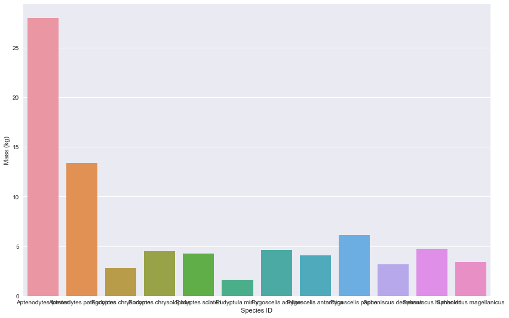
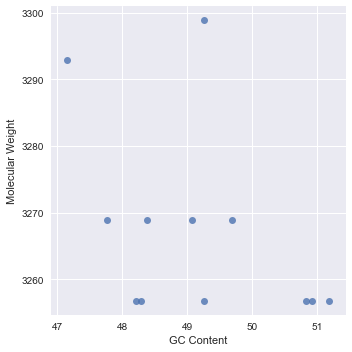

# Kevin Falk Python Assignment - 2017

## Question 1


```python
## 1 ##
#define a new function by def follwed by the function name "get_sequences_from_file" in this case.
#fasta_fn is the file that has been previously read in.
def get_sequences_from_file(fasta_fn):
#a new dictionary named "sequence_data_dict" is defined which is empty now but will be used within the function.
    sequence_data_dict = {}
#for loop starts by using biopython's sequence input/output interface "SeqIO".
#each record starts with a “>” line, SeqIO uses to locate new records in the file read in. 
#Parse() reads the records in one by one (fasta_fn) which is a "fasta" file. 
    for record in SeqIO.parse(fasta_fn, "fasta"):
#biopython uses the record.description function.
#.split() splits characters separated by white space - here it will split up all the words in the description.
        description = record.description.split()
#the function creates a species name by taking the first and second index (genus and species) and adding them together.
        species_name = description[1] + " " + description[2]
#fills the aforementioned dictionary (sequence_data_dict) with each individual record including it's species name.    
        sequence_data_dict[species_name] = record.seq
#returns the now completed dictionary (sequence_data_dict) that contains a record for each species name and its sequence.
    return(sequence_data_dict)
```

## Utilize the get_sequences_from_file function to get the sequences from our penguins_cytb.fasta file


```python
fasta_fn = "penguins_cytb.fasta"
(get_sequences_from_file(fasta_fn))
penguin_library = (get_sequences_from_file(fasta_fn))
```

# Question 2
## Write a function that translates a string of nucleotides to amino acids based on Dr. X's pseudo-code suggestion.


```python
## 2 ##
from Bio.Data import CodonTable

mito_table = CodonTable.unambiguous_dna_by_name["Vertebrate Mitochondrial"]

def translate_function(string_nucleotides): 
    #Bring in the codon table from Biopython
    #unambiguous_dna_by_name extends a codon list to include all possible ambigous codons
    mito_table = CodonTable.unambiguous_dna_by_name["Vertebrate Mitochondrial"]
    #initialize amino_acid variable
    amino_acid = ""
    #start a for loop to step through the sequence at 3 characters at a time
    #this is assuming the last codon is a stop codon (as it leaves the last 3 nucleotides out)
    for i in range(0, len(string_nucleotides)-3, 3):
        
        codon = string_nucleotides[i:i+3]
        aa = mito_table.forward_table[codon]
        amino_acid += aa
    return  amino_acid

translate_function("ATGGCCCTGGACCTTTCCACT")
```


    'MALDLS'


# Question 3
## Write an alternative translation function.


```python
## 3 ##
from Bio.Seq import Seq
from Bio import SeqIO
from Bio.Alphabet import IUPAC
#write a for loop that will read through the dictionary and pull the species names (description) and values (sequences)
for key, value in penguin_library.items():
    #use the biopython translate function to translate the DNA to protein
    protein = value.translate(to_stop=False)
    #print statement for each species
    print("Translation to protein of " + key +" : " + protein + "\n")
```

    Translation to protein of Aptenodytes forsteri : MAPNLRKSHPLLKIINNSLIDLPTPSNISA**NFGSLLGICLTTQILTGLLLAIHYTADTTLAFSSVAHTCRNVQYG*LIRNLHANGASFFFICIYLHIGRGFYYGSYLYKET*NTGIILLLTLMATAFVGYVLP*GQISF*GATVITNLFSAIPYIGQTLVEWT*GGFSVDNPTLTRFFALHFLLPFIIAGLTLIHLTFLHESGSNNPLGIVANSDKIPFHPYYSTKDILGFALILLPLTTLALFSPNLLGDPENFTPANPLVTPPHIKPE*YFLFAYAILRSIPNKLGGVLALAASVLILFLIPLLHKSKQRTIAFRPLSQLLF*ALVANLIILT*VGSQPVEHPFIIIGQLASLTYFTTLLILFPIAGALENKILNH*
    
    Translation to protein of Aptenodytes patagonicus : MAPNLRKSHPLLKIINNSLIDLPTPSNISA**NFGSLLGICLTTQILTGLLLAIHYTADTTLAFSSVAHTCRNVQYG*LIRNLHANGASFFFICIYLHIGRGFYYGSYLYKET*NTGIILLLTLIATAFVGYVLPWGQISF*GATVITNLFSAIPYIGQTLVE*A*GGFSVDNPTLTRFFALHFLLPFIIAGLTLIHLTFLHESGSNNPLGIVANSDKIPFHPYYSTKDTLGFALILLPLTTLALFSPNLLGDPENFTPANPLVTPPHIKPE*YFLFAYAILRSIPNKLGGVLALAASVLILFLIPLLHKSKQRTITFRPLSQLLF*TLVANLTILTWIGSQPVEHPFIIIGQLASLTYFTILLILFPLIGTLENKILNH*
    
    Translation to protein of Eudyptes chrysocome : MAPNLRKSHPLLKTINNSLIDLPTPSNISA**NFGSLLGICLATQILTGLLLAAHYTADTTLAFSSVAHTCRNVQYG*LIRNLHANGASFFFICIYLHIGRGLYYGSYLYKET*NTGIILLLTLIATAFVGYVLP*GQISF*GATVITNLFSAIPYIGQTLVEWA*GGFSVDNPTLTRFFTLHFLLPFIIAGLTLIHLTFLHESGSNNPLGIVANSDKIPFHPYYSTKDILGFILLLLPLTTLALFSPNLLGDPENFTPANPLVTPPHIKPEWYFLFAYAILRSIPNKLGGVLALAASVLILFLIPLLHKSKQRTITFRPLSQLLF*TLVANLTILT*IGSQPVEHPFIIIGQLASLTYFTILLILFPLIGTLENKILNH*
    
    Translation to protein of Eudyptes chrysolophus : MAPNLRKSHPLLKTINNSLIDLPTPSNISA**NFGSLLGICLATQILTGLLLAAHYTADTTLAFSSVAHTCRNVQYG*LIRNLHANGASFFFICIYLHIGRGLYYGSYLYKET*NTGIILLLTLIATAFVGYVLPWGQISF*GATVITNLFSAIPYIGQTLVEWA*GGFSVDNPTLTRFFTLHFLLPFIIAGLTLIHLTFLHESGSNNPLGIVANSDKIPFHPYYSTKDILGFILLLLPLTALALFSPNLLGDPENFTPANPLVTPPHIKPE*YFLFAYAILRSIPNKLGGVLALAASVLILFLIPLLHKSKQRTITFRPLSQLLF*TLVANLTILTWIGSQPVEHPFIIIGQLASLTYFTILLILFPLIGTLENKILNH*
    
    Translation to protein of Eudyptes sclateri : MAPNLRKSHPLLKTINNSLIDLPTPSNISA**NFGSLLGICLATQILTGLLLAAHYTADTTLAFSSVAHTCRNVQYG*LIRNLHANGASFFFICIYLHIGRGLYYGSYLYKET*NTGIILLLTLIATAFVGYVLPWGQISF*GATVITNLFSAIPYIGQTLVEWA*GGFSVDNPTLTRFFTLHFLLPFIIAGLTLIHLTFLHESGSNNPLGIVANSDKIPFHPYYSTKDILGFILLLLPLTTLALFSPNLLGDPENFTPANPLVTPPHIKPE*YFLFAYAILRSIPNKLGGVLALAASVLILFLIPLLHKSKQRTITFRPLSQLLF*TLVANLTILT*IGSQPVEHPFIIIGQLASLTYFTILLILFPLIGTLENKILNH*
    
    Translation to protein of Eudyptula minor : MAPNLRKSHPLLKIINNSLIDLPTPSNIST**NFGSLLGICLITQILTGLLLAAHYTADTTLAFSSIAHTCRNVQYG*LIRNLHANGASFFFICIYLHIGRGLYYGSYLYKET*NTGIILLITLIATAFVGYVLP*GQISF*GATVITNLFSAIPYIGQTLVE*A*GGFSVDNPTLTRFFALHFLLPFIITGLTLIHLTFLHESGSNNPLGIVANSDKIPFHPYYSTKDILGFILLLLPLTTLALFSPNLLGDPENFTPANPLVTPPHIKPE*YFLFAYAILRSIPNKLGGVLALAASVLILFLIPLLHKSKQRSIAFRPLSQLLF*TLVANLTILT*VGNQPVEHPFIIIGQLASLTYFTILLILFPLAGTLENKILSH*
    
    Translation to protein of Pygoscelis adeliae : MAPNLRKSHPLLKIINNSLIDLPTPSNISA**NFGSLLGICLTTQILTGLLLAMHYTADTTLAFSSIAHTCRDVQYG*LIRNLHANGASFFFICIYLHIGRGLYYGSYLYKET*NTGIILLLTLIATAFVGYVLP*GQMSF*GATVITNLFSAIPYIGQTLVEWA*GGFSVDNPTLTRFFALHFLLPFVIIGLTLIHLTFLHESGSNNPLGIVANSDKIPFHPYYSTKDILGFAFILLPLTTLALFSPNLLGDPENFTPANPLVTPPHIKPE*YFLFAYAILRSIPNKLGGVLALAASVLILFLIPLLHKSKQRTIAFRPLSQLLF*ALVANLAILTWVGSQPVEHPFIIIGQLASLTYFTILLILFPSIGALENKILNH*
    
    Translation to protein of Pygoscelis antarctica : MAPNLRKSHPLLKIINNSLIDLPTPSNISA**NFGSLLGICLTTQILTGLLLAIHYTADTTLAFSSIAHTCRDVQYG*LIRNIHANGASLLFICIYLHIGRGVYDGSYLHKET*NTGVILLLTLIATAFVGYVLP*GQISF*GATVITNLFSAIPYIGQTIVE*A*GGFSVDNPTLTRFFALHFLLPFIITGLTLIHLTFLHESGSNNPLGIVANSDKIPFHPYYSTKDILGFTLILLPLTTLALFSPNLLGDPENFTPANPLVTPPHIKPE*YFLFAYAILRSIPNKLGGVLALAASVLVLFLSPLLHKSKQRTIAFRPLSQLLF*TLVANLLILT*IGSQPVEHPFIIIGQLASTTYFIILLILFPITSALENKILNF*
    
    Translation to protein of Pygoscelis papua : MAPNLRKSHPLLKIINKSLIDLPTPPNISA**NFGSLLGICLITQILTGLLLAIHYTADTTLAFSSIAHTCRNVQYG*LIRNLHANGASFFFICIYFHIGRGLYYGSYLYKET*NTGIILLLTLIATAFVGYVLP*GQISF*GATVITNLFSAIPYVGQTLVE*A*GGFSVDNPTLTRFFALHFLLPFIITGLTLIHLTFLHESGSNNPLGIVANSDKIPFHPYYSTKDILGFALILLPLTTLALFSPNLLGDPENFTPANPLVTPPHIKPE*YFLFAYAILRSIPNKLGGVLALAASVLILFLSPLLHKSKQRTIAFRPLSQLLF*TLVANLLILT*IGSQPVEHPFIIIGQLASTTYFIILLILFPITSALENKILNF*
    
    Translation to protein of Spheniscus demersus : MAPNLRKSHPLLKTINNSLIDLPTPSNISA**NFGSLLGICLATQILTGLLLAAHYTADTTLAFSSVAHICRNVQYG*LIRNLHANGASFFFICIYLHIGRGLYYGSYLYKET*NTGIILLLTLIATAFVGYVLP*GQISF*GATVITNLFSAIPYIGQTLVE*A*GGFSVDNPTLTRFFALHFLLPFIITGLTLIHLTFLHESGSNNPLGIVANSDKIPFHPYYSTKDILGFILLLLPLTTLALFSPNLLGDPENFTPANPLVTPPHIKPE*YFLFAYAILRSIPNKLGGVLALAASVLILFLIPLLHKSKQRTIAFRPLSQLLF*TLVANLIILT*IGSQPVEHPFIAIGQLASFTYFTTLLILFPLAGALENKILNH*
    
    Translation to protein of Spheniscus humboldti : MAPNLRKSHPLLKTINNSLIDLPTPSNISA**NFGSLLSICLATQILTGLLLAAHYTADTTLAFSSVAHICRNVQYG*LIRNLHANGASFFFICIYLHIGRGLYYGSYLHKET*NTGIILLLTLIATAFVGYVLP*GQISF*GATVITNLFSAIPYIGQTLVE*A*GGFSVDNPTLTRFFALHFLLPFIITGLALIHLTFLHESGSNNPLGIVANSDKIPFHPYYSTKDILGFILLLLPLTTLALFSPNLLGDPENFTPANPLVTPPHIKPE*YFLFAYAILRSIPNKLGGVLALAASVLILFLIPLLHKSKQRTIAFRPLSQLLF*TLVANLIILT*VGSQPVEHPFIIIGQLASLTYFTTLLILFPLAGALENKILNH*
    
    Translation to protein of Spheniscus magellanicus : MAPNLRKSHPLLKTINNSLIDLPTPSNISA**NFGSLLGICLATQILTGLLLAAHYTADTTLAFSSVAHICRNVQYG*LIRNLHANGASFFFICIYLHIGRGLYYGSYLYKET*NTGIILLLTLIATAFVGYVLP*GQISF*GATVITNLFSAIPYIGQTLVE*A*GGFSVDNPTLTRFFALHFLLPFIITGLTLIHLTFLHESGSNNPLGIVANSDKIPFHPYYSTKDILGFILLLLPLTTLALFSPNLLGDPENFTPANPLVTPPHIKPE*YFLFAYAILRSIPNKLGGVLALAASVLILFLIPLLHKSKQRTIAFRPLSQLLF*TLVANLIILT*VGSQPVEHPFIIIGQLASFTYFTTLLILFPLAGALENKILNH*
    
    

# Question 4
## Write a function that calculates the molecular of each 3 amino acid sequence.


```python
## 4 ##
from Bio.SeqUtils.ProtParam import ProteinAnalysis
from Bio.Seq import Seq
from Bio import SeqIO
from Bio.Alphabet import IUPAC

#create a variable that will be needed in the loop
molecular_weight_list = []
#write a for loop that will read through the dictionary and pull the species names (description) and values (sequences)
for key, value in penguin_library.items():
    #use the biopython translate function to translate the DNA to protein
    protein = value.translate(to_stop=True)
    #use the str() function to change the variable into a string
    protein_string = str(protein) 
    #use the PROTEINANALYSIS function to analyse the sequence
    analysed_seq = ProteinAnalysis(protein_string)
    #use the MOLECULAR_WEIGHT function to acquire the molecular weight
    string_weight = str(analysed_seq.molecular_weight())
    #create a list of all the molecular weights to use later
    molecular_weight_list.append(string_weight)
    #print statement for each species
    print("Molecular weight of " + key +" protein: " + string_weight)
```

    Molecular weight of Aptenodytes forsteri protein: 3268.8268000000007
    Molecular weight of Aptenodytes patagonicus protein: 3268.8268000000007
    Molecular weight of Eudyptes chrysocome protein: 3256.7731000000013
    Molecular weight of Eudyptes chrysolophus protein: 3256.7731000000013
    Molecular weight of Eudyptes sclateri protein: 3256.7731000000013
    Molecular weight of Eudyptula minor protein: 3298.8528000000015
    Molecular weight of Pygoscelis adeliae protein: 3268.8268000000007
    Molecular weight of Pygoscelis antarctica protein: 3268.8268000000007
    Molecular weight of Pygoscelis papua protein: 3292.934400000001
    Molecular weight of Spheniscus demersus protein: 3256.7731000000013
    Molecular weight of Spheniscus humboldti protein: 3256.7731000000013
    Molecular weight of Spheniscus magellanicus protein: 3256.7731000000013
    

# Question 5
## Write a function that computes the GC-content of each DNA sequence.


```python
## 5 ##
from Bio.Seq import Seq
from Bio import SeqIO
from Bio.Alphabet import IUPAC
from Bio.SeqUtils import GC
#write a for loop that will read through the dictionary and pull the species names (description) and values (sequences)
for key, value in penguin_library.items():
    #use the biopython function GC() to calculate GC content
    GC_content = GC(value)
    #convert GC content to a string for use later
    GC_string = str(GC_content)
    #print statement for each species
    print("GC content of " + key + " sequence: " + GC_string)
```

    GC content of Aptenodytes forsteri sequence: 48.38145231846019
    GC content of Aptenodytes patagonicus sequence: 49.69378827646544
    GC content of Eudyptes chrysocome sequence: 51.181102362204726
    GC content of Eudyptes chrysolophus sequence: 50.91863517060367
    GC content of Eudyptes sclateri sequence: 50.83114610673666
    GC content of Eudyptula minor sequence: 49.25634295713036
    GC content of Pygoscelis adeliae sequence: 49.08136482939633
    GC content of Pygoscelis antarctica sequence: 47.76902887139108
    GC content of Pygoscelis papua sequence: 47.15660542432196
    GC content of Spheniscus demersus sequence: 48.29396325459317
    GC content of Spheniscus humboldti sequence: 49.25634295713036
    GC content of Spheniscus magellanicus sequence: 48.20647419072616
    

# Question 6
## Add two new columns to the penguin DataFrame: (1) molecular weight and (2) GC content.


```python
## 6 ##
import numpy as np
import pandas as pd
penguins_df = pd.read_csv("penguins_mass.csv") # Includes only data for body mass 
#add new columns to df and set them as not a number (NaN)
penguins_df["Molecular Weight"] = np.nan
penguins_df["GC Content"] = np.nan
```

# Question 7:
## Call your functions from step 3 (or step 2) and step 4 and fill in the new columns in the DataFrame.


```python
## 7 ##
from Bio.Seq import Seq
from Bio import SeqIO
from Bio.Alphabet import IUPAC
from Bio.SeqUtils import GC
from Bio.SeqUtils.ProtParam import ProteinAnalysis
import numpy as np
import pandas as pd

#write a for loop that will read through the dictionary and pull the species names (description) and values (sequences)
for key, value in penguin_library.items():
    #use the biopython translate function to translate the DNA to protein
    protein = value.translate(to_stop=True)
    #use the str() function to change the variable into a string
    protein_string = str(protein) 
    #use the PROTEINANALYSIS function to analyse the sequence
    analysed_seq = ProteinAnalysis(protein_string)
    #use the MOLECULAR_WEIGHT function to acquire the molecular weight
    string_weight = str(analysed_seq.molecular_weight())
    #create a list of all the molecular weights to use later
    molecular_weight_list.append(string_weight)
    #use the biopython function GC() to calculate GC content
    GC_content = GC(value)
    #convert GC content to a string for use later
    GC_string = str(GC_content)
    #create a list of all the GC Content to use later
    GC_content_list.append(GC_content)

#change list to an array so that we can append it to our dataframe
molecular_weight_array = np.asarray(molecular_weight_list)
#add array to our data frame under Molecular Weight column heading
penguins_df["Molecular Weight"] = pd.Series(molecular_weight_array)

#change list to an array so that we can append it to our dataframe
GC_content_array = np.asarray(GC_content_list)
#add array to our data frame under GC Content column heading
penguins_df["GC Content"] = pd.Series(GC_content_array)

#display dataframe
penguins_df

```


<div>
<table border="1" class="dataframe">
  <thead>
    <tr style="text-align: right;">
      <th></th>
      <th>species</th>
      <th>mass</th>
      <th>Molecular Weight</th>
      <th>GC Content</th>
    </tr>
  </thead>
  <tbody>
    <tr>
      <th>0</th>
      <td>Aptenodytes forsteri</td>
      <td>28.00</td>
      <td>3268.8268000000007</td>
      <td>48.381452</td>
    </tr>
    <tr>
      <th>1</th>
      <td>Aptenodytes patagonicus</td>
      <td>13.40</td>
      <td>3268.8268000000007</td>
      <td>49.693788</td>
    </tr>
    <tr>
      <th>2</th>
      <td>Eudyptes chrysocome</td>
      <td>2.80</td>
      <td>3256.7731000000013</td>
      <td>51.181102</td>
    </tr>
    <tr>
      <th>3</th>
      <td>Eudyptes chrysolophus</td>
      <td>4.50</td>
      <td>3256.7731000000013</td>
      <td>50.918635</td>
    </tr>
    <tr>
      <th>4</th>
      <td>Eudyptes sclateri</td>
      <td>4.25</td>
      <td>3256.7731000000013</td>
      <td>50.831146</td>
    </tr>
    <tr>
      <th>5</th>
      <td>Eudyptula minor</td>
      <td>1.60</td>
      <td>3298.8528000000015</td>
      <td>49.256343</td>
    </tr>
    <tr>
      <th>6</th>
      <td>Pygoscelis adeliae</td>
      <td>4.60</td>
      <td>3268.8268000000007</td>
      <td>49.081365</td>
    </tr>
    <tr>
      <th>7</th>
      <td>Pygoscelis antarctica</td>
      <td>4.10</td>
      <td>3268.8268000000007</td>
      <td>47.769029</td>
    </tr>
    <tr>
      <th>8</th>
      <td>Pygoscelis papua</td>
      <td>6.10</td>
      <td>3292.934400000001</td>
      <td>47.156605</td>
    </tr>
    <tr>
      <th>9</th>
      <td>Spheniscus demersus</td>
      <td>3.20</td>
      <td>3256.7731000000013</td>
      <td>48.293963</td>
    </tr>
    <tr>
      <th>10</th>
      <td>Spheniscus humboldti</td>
      <td>4.75</td>
      <td>3256.7731000000013</td>
      <td>49.256343</td>
    </tr>
    <tr>
      <th>11</th>
      <td>Spheniscus magellanicus</td>
      <td>3.40</td>
      <td>3256.7731000000013</td>
      <td>48.206474</td>
    </tr>
  </tbody>
</table>
</div>


```python
## 7 ##
#####################################################################
#from Bio.Seq import Seq
#from Bio import SeqIO
#from Bio.Alphabet import IUPAC
#from Bio.SeqUtils import GC
#from Bio.SeqUtils.ProtParam import ProteinAnalysis
#import numpy as np
#import pandas as pd
#
#penguins_df = pd.read_csv("penguins_mass.csv") # Includes only data for body mass 
#penguins_df["Molecular Weight"] = np.nan
#penguins_df["GC Content"] = np.nan
#
#penguins_df.set_index("species", inplace=True)
#for key, value in penguin_library.items():
#    protein = value.translate(to_stop=True)
#    protein_string = str(protein) 
#    analysed_seq = ProteinAnalysis(protein_string)
#    penguins_df.loc[key,"Molecular Weight"] = analysed_seq.molecular_weight()
#    penguins_df.loc[key,"GC Content"] = GC(value)
#
#penguins_df
## 
```

# Question 8
## Plot a bar-chart of the mass with the x-axes labeled with species names.


```python
## 8 ##
#import matplot lib and seaborn
import matplotlib.pyplot as plt
import seaborn as sns

#set the plot dimensions
plot_dims = (14, 9)

#Create barchart using matplotlib and seaborn
fig, ax = plt.subplots(figsize=plot_dims)
#set x variable as species and y variable as mass
sns.barplot(x = 'species', y = 'mass', data=penguins_df)
#set labels of chart
ax.set(xlabel='Species ID', ylabel='Mass (kg)')

## *Q1* What is the smallest penguin species? 
#Eudyptula minor
## *Q2* What else is interesting about this species?
#Their protein has the highest molecular weight of all the penguins in the dataset


```


    [<matplotlib.text.Text at 0x19bddce6eb8>,
     <matplotlib.text.Text at 0x19bdda232b0>]





# Question 9
## Plot a visualization of the molecular weight (y-axis) as a function of GC-content (x-axis).


```python
## 9 ##
import seaborn as sns
%matplotlib inline
#I had to change "Molecular Weight" to a number for this to work (I was getting an error).
penguins_df1 = penguins_df.apply(pd.to_numeric, errors='coerce')
#use the lmplot function to plot our data across a FacetGrid
sns.lmplot("GC Content", "Molecular Weight", data=penguins_df1, fit_reg=False)
```


    <seaborn.axisgrid.FacetGrid at 0x19be097d710>





# Question 10
## Save the new DataFrame to a file called "penguins_mass_cytb.csv"


```python
## 10 ##
## Save the new DataFrame to a file called "penguins_mass_cytb.csv"
penguins_df.to_csv("penguins_mass_cytb.csv", sep=',', encoding='utf-8', index=False)
```


```python
penguins_df
```


<div>
<table border="1" class="dataframe">
  <thead>
    <tr style="text-align: right;">
      <th></th>
      <th>species</th>
      <th>mass</th>
      <th>Molecular Weight</th>
      <th>GC Content</th>
    </tr>
  </thead>
  <tbody>
    <tr>
      <th>0</th>
      <td>Aptenodytes forsteri</td>
      <td>28.00</td>
      <td>3268.8268000000007</td>
      <td>48.381452</td>
    </tr>
    <tr>
      <th>1</th>
      <td>Aptenodytes patagonicus</td>
      <td>13.40</td>
      <td>3268.8268000000007</td>
      <td>49.693788</td>
    </tr>
    <tr>
      <th>2</th>
      <td>Eudyptes chrysocome</td>
      <td>2.80</td>
      <td>3256.7731000000013</td>
      <td>51.181102</td>
    </tr>
    <tr>
      <th>3</th>
      <td>Eudyptes chrysolophus</td>
      <td>4.50</td>
      <td>3256.7731000000013</td>
      <td>50.918635</td>
    </tr>
    <tr>
      <th>4</th>
      <td>Eudyptes sclateri</td>
      <td>4.25</td>
      <td>3256.7731000000013</td>
      <td>50.831146</td>
    </tr>
    <tr>
      <th>5</th>
      <td>Eudyptula minor</td>
      <td>1.60</td>
      <td>3298.8528000000015</td>
      <td>49.256343</td>
    </tr>
    <tr>
      <th>6</th>
      <td>Pygoscelis adeliae</td>
      <td>4.60</td>
      <td>3268.8268000000007</td>
      <td>49.081365</td>
    </tr>
    <tr>
      <th>7</th>
      <td>Pygoscelis antarctica</td>
      <td>4.10</td>
      <td>3268.8268000000007</td>
      <td>47.769029</td>
    </tr>
    <tr>
      <th>8</th>
      <td>Pygoscelis papua</td>
      <td>6.10</td>
      <td>3292.934400000001</td>
      <td>47.156605</td>
    </tr>
    <tr>
      <th>9</th>
      <td>Spheniscus demersus</td>
      <td>3.20</td>
      <td>3256.7731000000013</td>
      <td>48.293963</td>
    </tr>
    <tr>
      <th>10</th>
      <td>Spheniscus humboldti</td>
      <td>4.75</td>
      <td>3256.7731000000013</td>
      <td>49.256343</td>
    </tr>
    <tr>
      <th>11</th>
      <td>Spheniscus magellanicus</td>
      <td>3.40</td>
      <td>3256.7731000000013</td>
      <td>48.206474</td>
    </tr>
  </tbody>
</table>
</div>


```python

```
